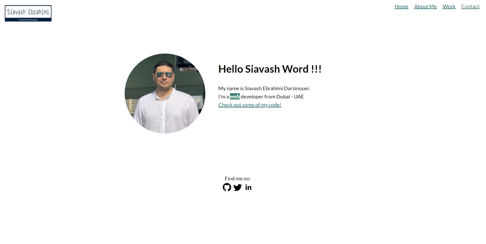
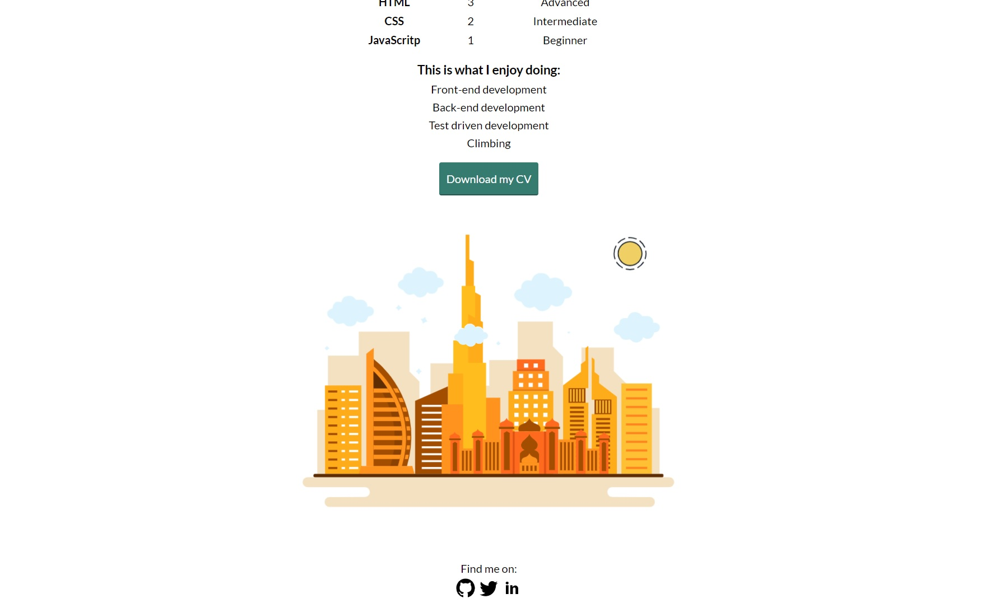

# Portfolio-Website 

This is my portfolio website that shows my latest released applications. Also, this is my first project as a full-stack web developer student.

## Key Features

* The website displays a welcome view.
* The website displays a about page view.
* The website displays a contact page view.
* The website displays a work view.

## App Screenshots

## Technologies Used

* HTML
* CSS
* Java Script

## Links
* Live App: https://siavash-ebrahimi.github.io/portfolio-website/

